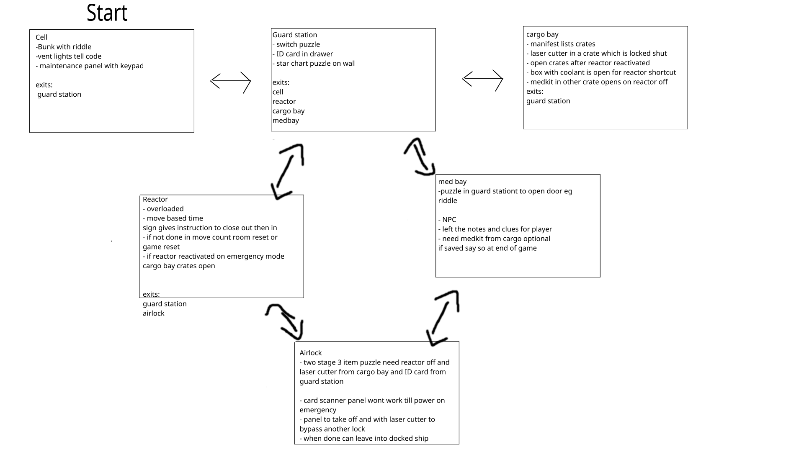
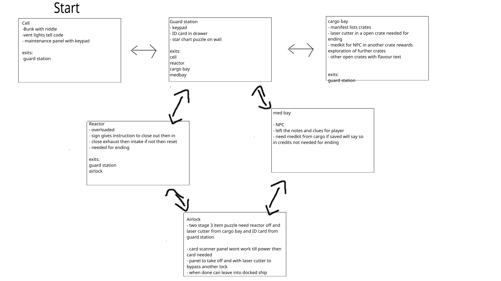
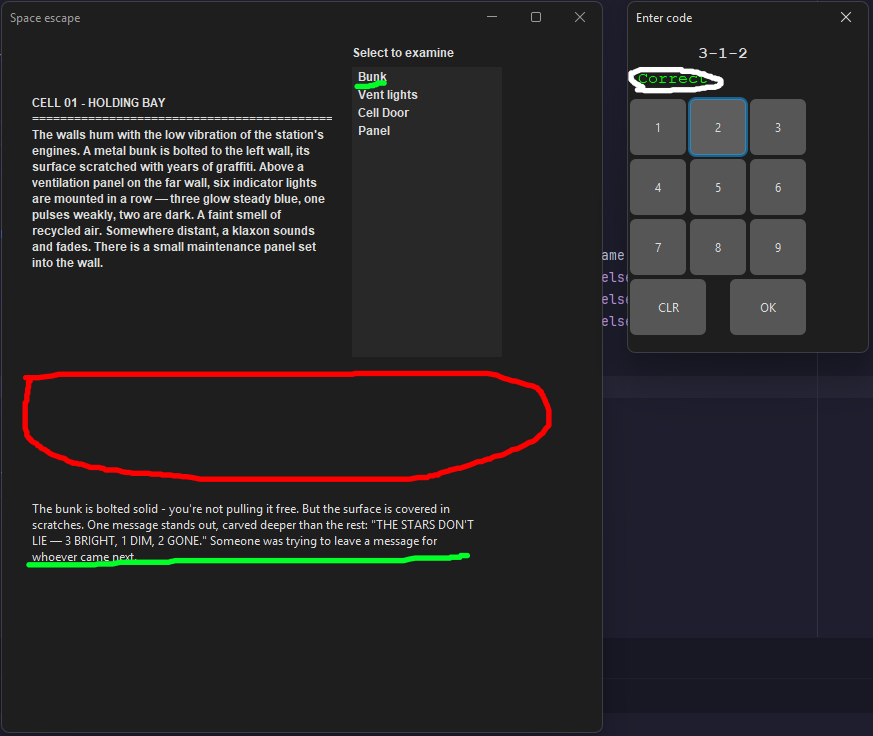

# Development Log

The development log captures key moments in your application development:

- **Design ideas / notes** for features, UI, etc.
- **Key features** completed and working
- **Interesting bugs** and how you overcame them
- **Significant changes** to your design
- Etc.

---

## Date: 19/04/2026

Realized I have made my planned puzzle a little too complicated for the time I have 
so scaled down to a more doable set of puzzles

before:

After

---

## Date: 20/04/2026

If I enter a code while selected onto a different Interactable
than the one that activates the code the puzzle isn't solved and 
so the doors or etc do not open or change

As seen in above image the code has been entered correctly as circled in white
but the player has selected the bunk Interactable after opening the panel window 
as shown in green which means that the puzzle hasn't been marked as completed
so no doors have opened as circled in red

### Solution:
In order to fix this I added a target Interactable to the PuzzleWindow class
that is at first set to null then I made sure to change mentions of app.currentInteractable
to targetInteractable and then in the show function in PuzzleWindow I made it accept an Interactable 
and to make it a local variable of interactable within the variable and then passed in the 
currentInteractable in when the player clicks on the item in the interactable list

---

## Date: 29/04/2026

Simplified even further than by removing medbay entirely in order to cut down on
time required for project

This means I removed the entry in the rooms list and could remove the 4th button from
the movement buttons in the main window

---

