# Results of Testing

The test results show the actual outcome of the testing, following the [Test Plan](test-plan.md)

---

## Examine items in a room

Click on an item in the examine list to verify that the correct description is displayed in the description area.

### Test Data Used

Selected the "Bunk" interactable in Cell 01. Valid data — a standard non-puzzle interactable.

### Test Result

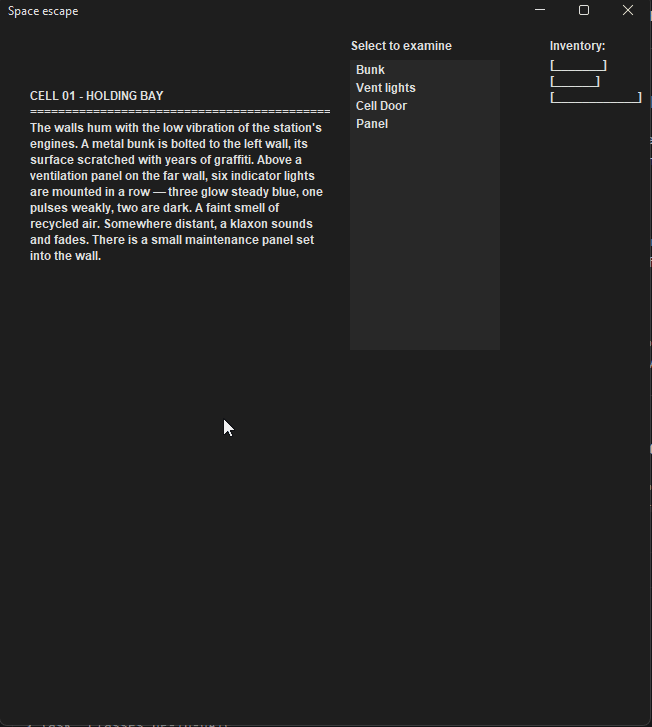

---

## Move between rooms - VALID

Click an exit button to move to an adjacent room and verify the room description, examine list, and exit buttons all update correctly.

### Test Data Used

Solved the Panel puzzle in Cell 01 first, then clicked the "GUARD STATION" exit button. Valid data. The Guard Station is a defined exit of Cell 01 and the puzzle gating condition was met.

### Test Result

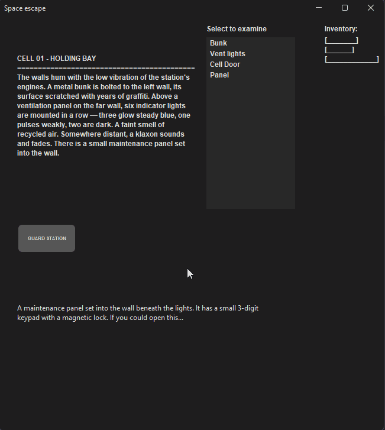

---

## Move to room when unable to - INVALID

Attempt to click an exit button while there is an unsolved puzzle in the current room, to verify that movement is blocked.

### Test Data Used

In Cell 01, with the Panel puzzle unsolved, attempted to click the exit button to the Guard Station. 

### Test Result

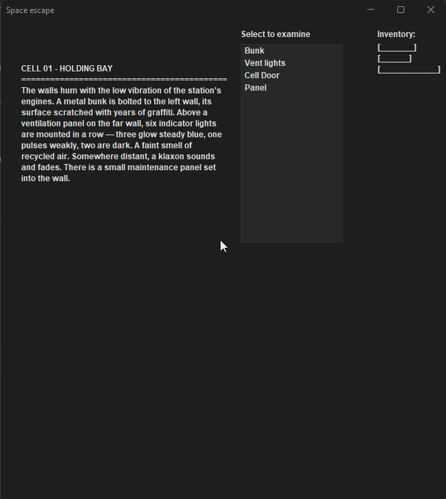

---

## Complete first puzzle - VALID

Enter the correct three-digit code into the Panel puzzle in Cell 01 to verify the puzzle is marked as solved and movement is unlocked.

### Test Data Used

Entered code "312" into the Panel puzzle. Valid data derived from the Bunk clue ("3 BRIGHT, 1 DIM, 2 GONE") matching the vent lights.

### Test Result

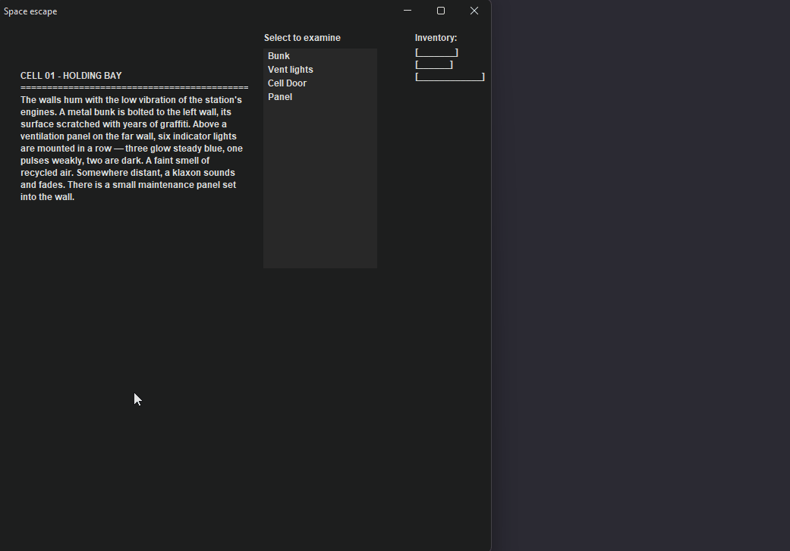

---

## Get first puzzle incorrect - INVALID

Enter a wrong code into the Panel puzzle in Cell 01 to verify that incorrect entry is rejected and the puzzle remains unsolved.

### Test Data Used

Entered code "111" into the Panel puzzle. Invalid data — does not match the correct code of "312".

### Test Result

---

## Get second puzzle incorrect and then correct - INVALID and VALID

Enter a wrong code then the correct code into the Console puzzle in the Guard Station to verify both outcomes.

### Test Data Used

First entered "111" as invalid data, then entered "365" as valid data. The correct code is derived from the star map showing three, six, and five stars.

### Test Result

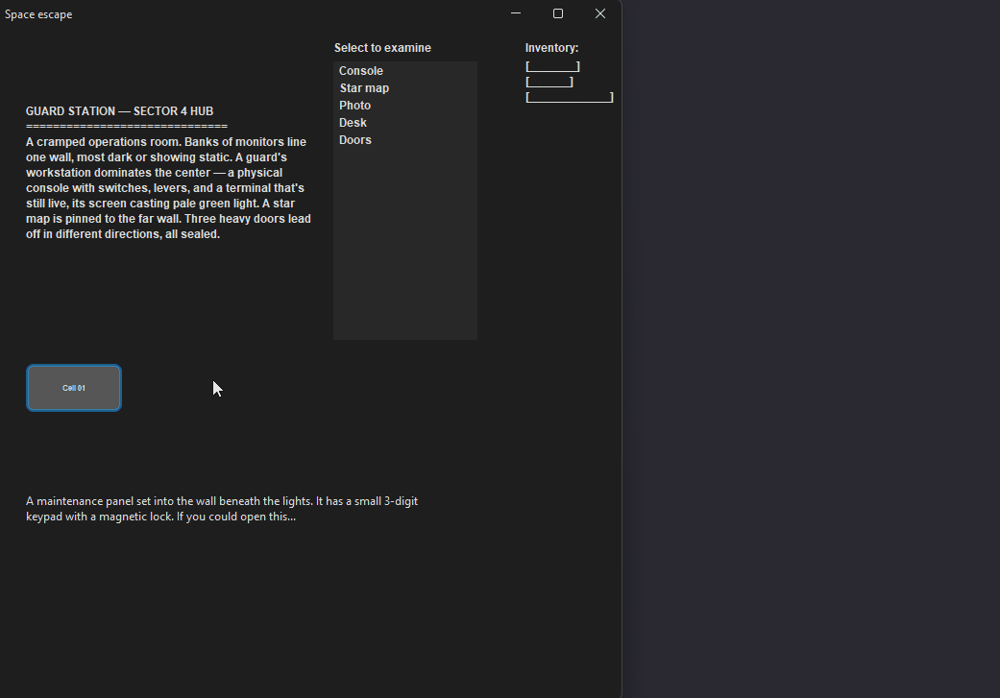

---

## Collect ID card from desk in second room - VALID

Select the Desk interactable in the Guard Station to verify the ID card is added to the inventory.

### Test Data Used

Navigated to the Guard Station and selected "Desk" from the examine list. Valid data — the Desk is present in the room and an inventory slot is available.

### Test Result

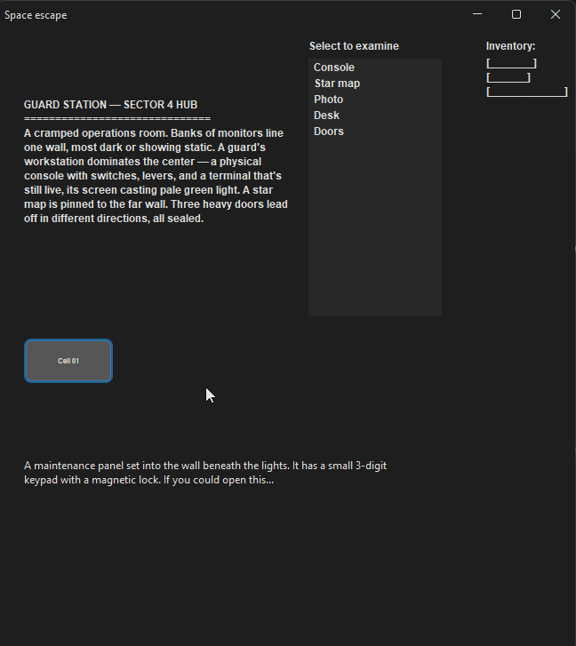

---

## Collect items from cargo bay - VALID

Select Crate 2 and Crate 3 in the Cargo Bay to verify the medkit and laser cutter are added to the inventory.

### Test Data Used

Navigated to the Cargo Bay and selected "Crate 2" then "Crate 3". Valid data — both crates are open and their items are available for collection.

### Test Result

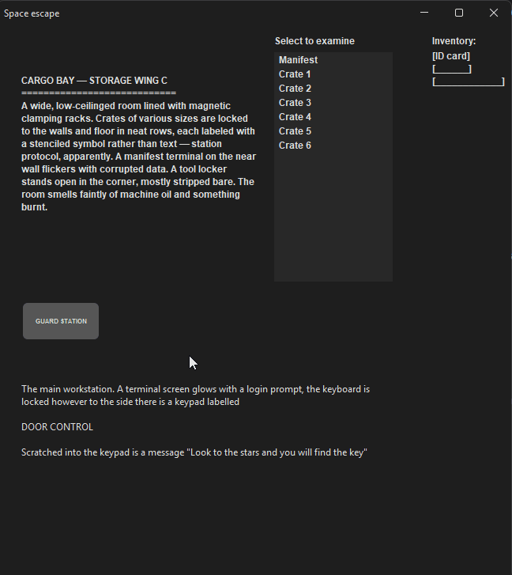

---

## Get reactor puzzle incorrect and then correct - INVALID and VALID

Press the levers in the wrong order then reset and press them in the correct order to verify both outcomes.

### Test Data Used

First pressed Intake (I) then Exhaust (E) as invalid data, then reset and pressed Exhaust (E) then Intake (I) as valid data, matching the placard instruction "ALWAYS CLOSE EXHAUST BEFORE INTAKE".

### Test Result

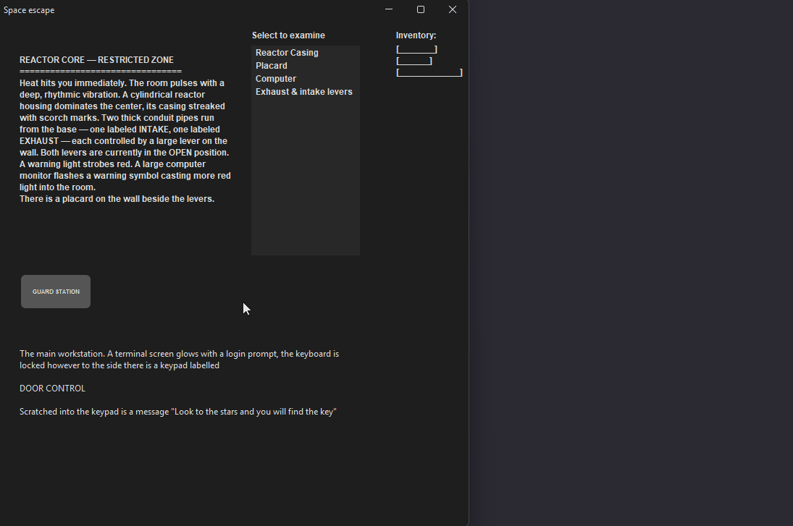

Lever feedback labels don't always change. Fixed by wrapping the code to reset the labels in an if statement checking if the code entered so far is empty

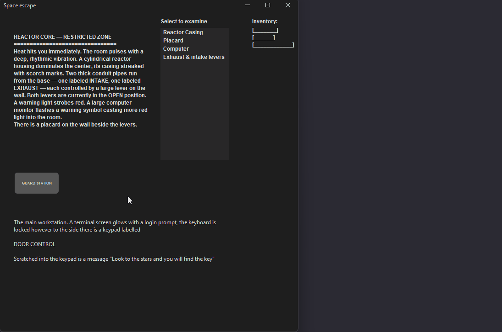

---

## Attempt override puzzle with no items - INVALID

Open the Override Panel puzzle with no relevant items in the inventory and attempt to cut the panel open.

### Test Data Used

Navigated to the Airlock without collecting the laser cutter or ID card and clicked "Cut panel open". 

### Test Result

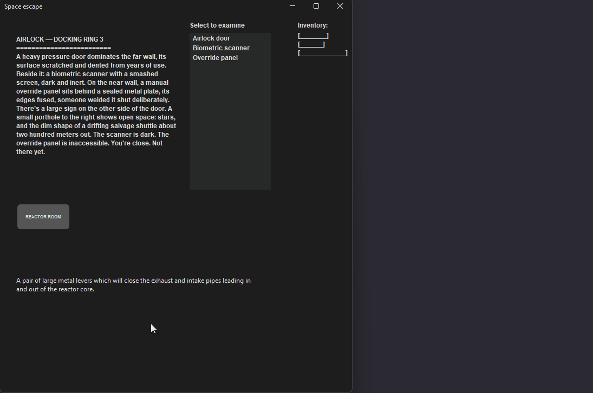

---

## Attempt override puzzle with laser cutter only

Open the Override Panel puzzle with only the laser cutter collected, cut the panel open, then attempt to use the terminal without an ID card.

### Test Data Used

Collected the laser cutter from Crate 3 but not the ID card from the Desk. Clicked "Cut panel open" (valid) then "Use ID card" (invalid as ID card absent).

### Test Result

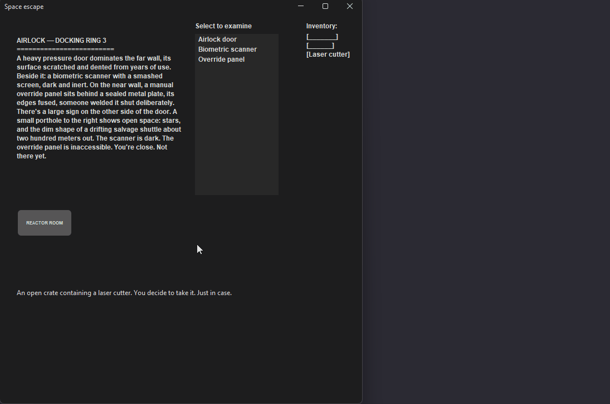

---

## Attempt override puzzle with ID card only

Open the Override Panel puzzle with only the ID card collected and attempt to cut the panel without a laser cutter.

### Test Data Used

Collected the ID card from the Desk but not the laser cutter from Crate 3. Clicked "Cut panel open".

### Test Result

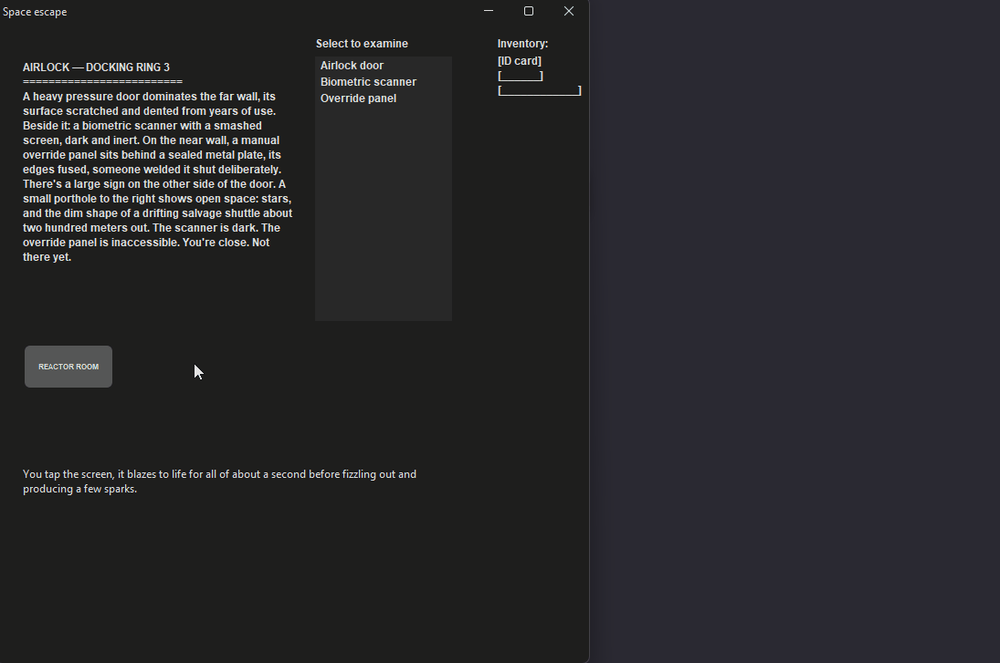

---

## Attempt override puzzle with both items

Open the Override Panel puzzle with both the laser cutter and ID card collected and complete both stages.

### Test Data Used

Collected the laser cutter from Crate 3 and the ID card from the Desk, then clicked "Cut panel open" followed by "Use ID card". Valid data — both required items are present.

### Test Result

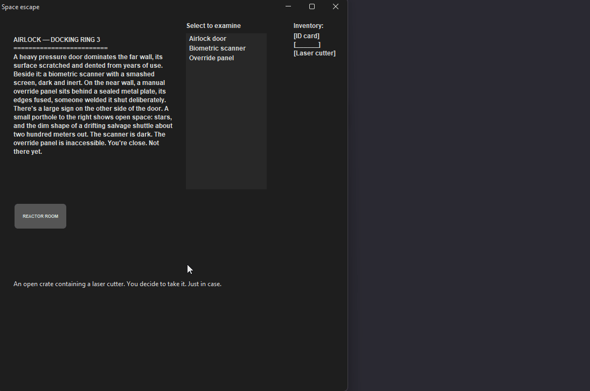

---

## Escape and complete the game

With all puzzles solved and both items collected, click the exit from the Airlock to complete the game.

### Test Data Used

Completed all puzzles and collected both the ID card and laser cutter, then clicked the exit button leading to the "Salvage shuttle, escape" room. Valid data — represents the successful completion state.

### Test Result

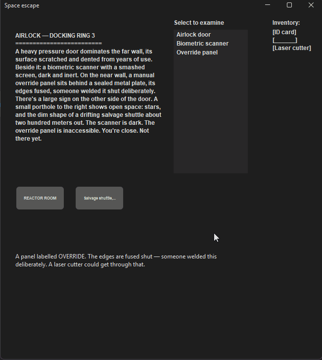

Escape test is cut off fixed with <html><wrap>

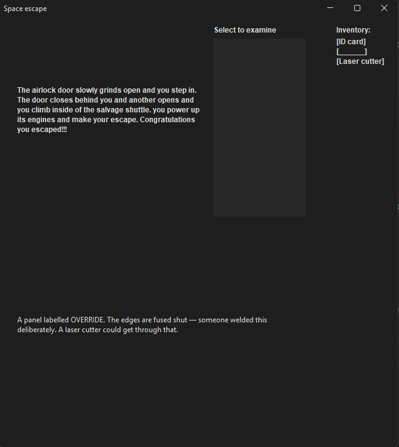

The examine description also doesn't disappear I will fix this in clean up at the bottom of this page

---

## Code entry - too few digits - BOUNDARY

Open a code entry puzzle and press OK after entering fewer than the required three digits to verify the puzzle rejects an incomplete code.

### Test Data Used

Opened the Panel puzzle in Cell 01, entered only two digits "3" and "1", then pressed OK.

### Test Result

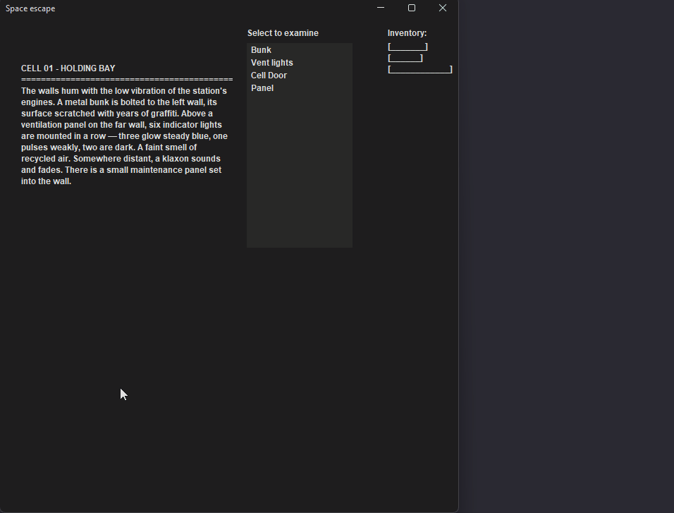

---

## Code entry - too many digits - BOUNDARY

Open a code entry puzzle and press OK after entering more than the required three digits to verify the puzzle rejects an oversized code.

### Test Data Used

Opened the Panel puzzle in Cell 01, entered four digits "3", "1", "2", "1", then pressed OK.

### Test Result

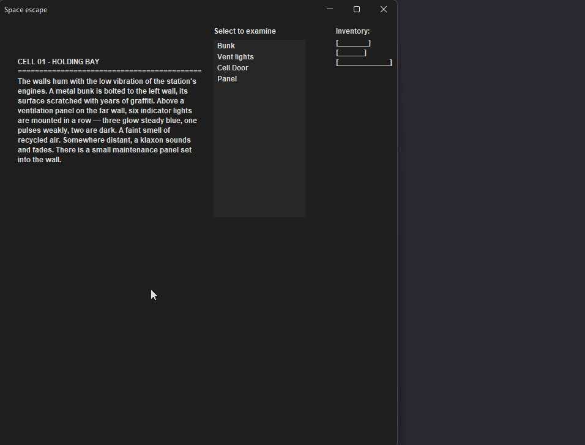

Puzzle does not solve if too many numbers are entered. Fixed by doing a length check on the entered code when handling button presses.

---

## Lever sequence - too few presses - BOUNDARY

Open the lever puzzle and press only one lever to verify that the puzzle does not check or accept an incomplete sequence.

### Test Data Used

Opened the Exhaust & intake levers puzzle and pressed only the Exhaust (E) button without pressing a second lever. Boundary data — one press below the minimum valid sequence length of 2.

### Test Result

---

# Fixes and clean up 

